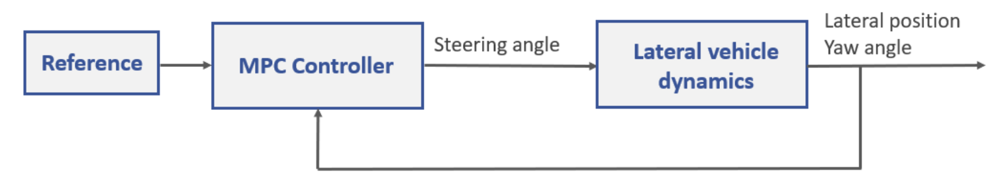
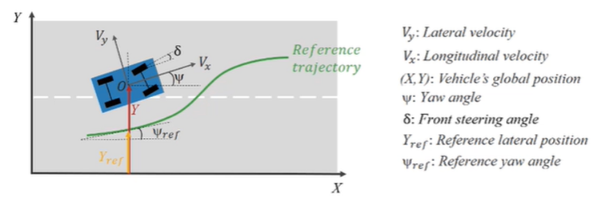

# MPC Virtual Lab

  

This virtual lab contains interactive exercises to study the design of linear and adaptive model predictive controllers (MPCs) for implementing a vehicle steering control system.

The lab solutions are available upon instructor request. If you would like to request solutions, find an issue, or have a suggestion, contact us [here](https://forms.office.com/r/00RBNtyyj2).

## Learning Goals
- Model and simulate lateral vehicle dynamics
- Design a linear MPC controller for the vehicle steering control system
- Design an adaptive MPC controller for the vehicle steering control system
- Bonus: Create custom trajectory and/or learn about methods for improved controllers

## Setup 
To get started with the MPC virtual lab, double-click the MPCVirtualLab.prj file inside MATLAB™. Then open up the MPC_virtual_lab.mlx live script, where you'll find the instructions for running the interactive exercises to complete the virtual lab.

## Suggeted Prework
- [MPC Tech Talks](https://www.youtube.com/watch?v=8U0xiOkDcmw&list=PLn8PRpmsu08ozoeoXgxPSBKLyd4YEHww8) help students gain insights into why engineers use Model Predictive Control, how they work and the difference between linear and non-linear Model Predictive Control.
- [MATLAB Onramp](https://matlabacademy.mathworks.com/details/matlab-onramp/gettingstarted) – a free two-hour introductory tutorial that teaches the essentials of MATLAB.
- [Simulink Onramp](https://matlabacademy.mathworks.com/details/simulink-onramp/simulink) – a free three-hour introductory tutorial that teaches the essentials of Simulink.

Additional information about set up

## MathWorks Products (https://www.mathworks.com)

Requires MATLAB release R2023b or newer
- [MATLAB](https://www.mathworks.com/products/matlab.html)
- [Simulink®](https://www.mathworks.com/products/simulink.html)
- [Model Predictive Control Toolbox™](https://www.mathworks.com/products/model-predictive-control.html)
- [Automated Driving Toolbox™](https://www.mathworks.com/products/automated-driving.html)

## Educator Resources
- [Controls courseware](https://www.mathworks.com/academia/courseware/teaching-controls-with-matlab-and-simulink.html)
- [Teaching Modeling and Controls using MATLAB Live Scripts](https://www.mathworks.com/videos/teaching-modeling-and-controls-with-the-matlab-live-editor-1623992486476.html?s_tid=srchtitle_teaching%20modeling%20and%20controls_1)
- [Virtual Labs and Projects with MATLAB and Simulink](https://www.mathworks.com/academia/educators/resources.html)

## License
The license is available in the License.txt file in this GitHub repository.

The lab solutions are available upon instructor request. If you would like to request solutions, find an issue, or have a suggestion, contact us [here](https://forms.office.com/r/00RBNtyyj2).

Copyright 2023 The MathWorks, Inc.
